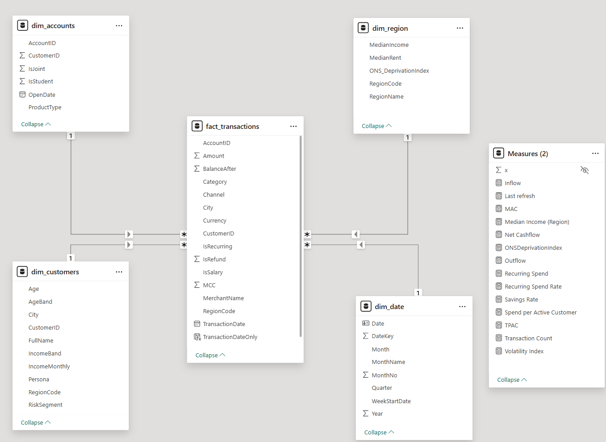
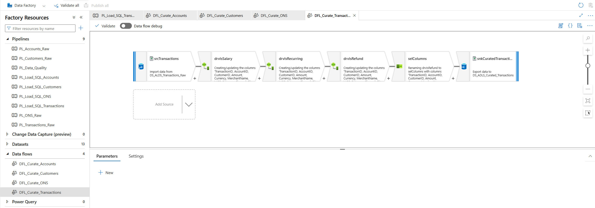
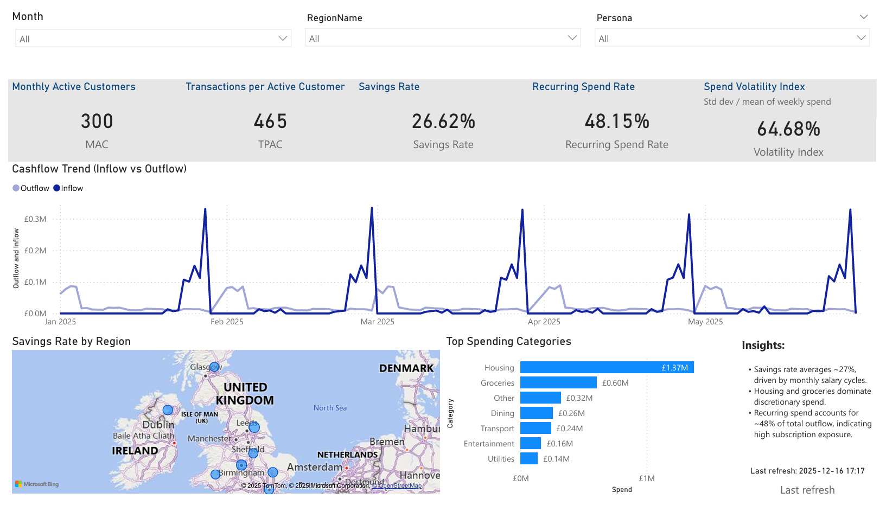
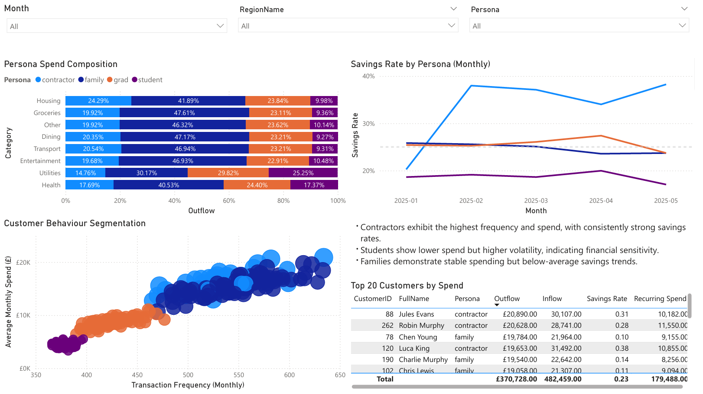
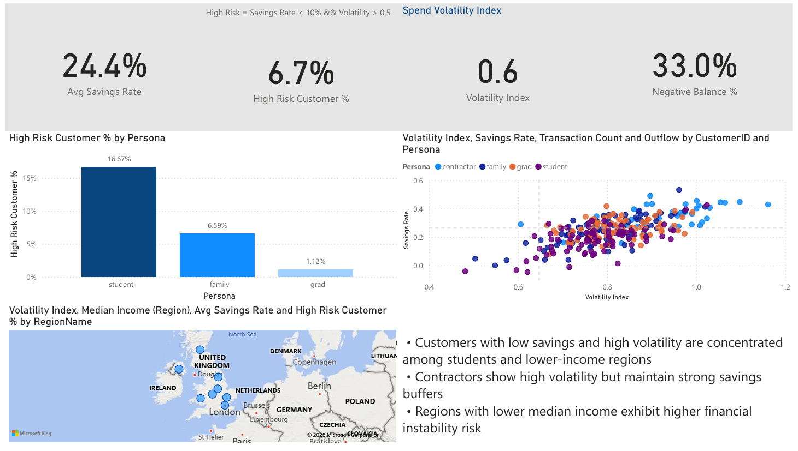

# UK Open Banking Data Engineering Project (Azure End-to-End)

## Abstract
Hi, I'm Dang — an aspiring Data Engineer with a strong interest in fintech and analytics platforms.

This project is a practical, end-to-end implementation of a **production-minded data engineering pipeline** inspired by UK Open Banking systems. It focuses on **data ingestion, transformation, validation, modelling, orchestration, and analytics enablement** using Azure-native services.

While a Power BI report is included, it is treated strictly as a **downstream consumer**, not the core of the project.

---

## Project Overview

This project demonstrates an **end-to-end data engineering workflow on Microsoft Azure**, designed to ingest, validate, transform, model, and serve financial transaction data at scale.

Primary engineering goals:

- Cloud-native ingestion and orchestration
- Lakehouse-style zoning (Raw → Curated)
- Deterministic transformation logic
- Staging-based data quality enforcement
- Analytics-ready dimensional modelling
- Automated, scheduled pipelines
- Downstream semantic consumption

---

## High-Level Architecture

```

Synthetic Open Banking Data (CSV)
↓
Azure Data Lake Storage Gen2 (Raw Zone)
↓
Azure Data Factory (Mapping Data Flows)
↓
Azure Data Lake Storage Gen2 (Curated Zone)
↓
Azure Data Factory (Upsert → Staging Tables)
↓
Azure SQL Stored Procedures (Validation + Merge)
↓
Azure SQL Database (Star Schema)
↓
Power BI Desktop (Semantic Model & Reporting)

```

### Design Philosophy

- Raw data is immutable
- Transformations are reproducible
- Business rules are enforced upstream
- SQL layer is analytics-safe
- BI layer remains lightweight and semantic-only

---

## Data Architecture

### Star Schema (Analytics Layer)

The warehouse follows a **Kimball-style dimensional model**, optimised for BI and analytical workloads.

#### Fact Table

**fact_transactions**  
Grain: **one row per financial transaction**

- TransactionID
- AccountID
- CustomerID
- TransactionDate
- Amount
- BalanceAfter
- Currency
- MerchantName
- MCC
- City
- Category
- Channel
- IsRecurring
- IsSalary
- IsRefund
- RegionCode

#### Dimension Tables

- **dim_customers**
  - Customer demographics
  - Persona classification
  - Income bands
- **dim_accounts**
  - Account types
  - Student / joint flags
- **dim_region**
  - ONS Deprivation Index
  - Median income
  - Median rent
- **dim_date**
  - Calendar attributes (derived in Power BI)

**Star Schema Diagram**



---

## Staging Layer (Data Quality Control)

A **staging table** is introduced to enforce quality gates before data reaches the fact table.

### stg_transactions

Purpose:
- Temporary landing table for curated data
- Acts as a quality buffer
- Enables validation and controlled merges

Key characteristics:
- Matches curated schema
- Not used by analytics
- Supports idempotent upserts
- Prevents invalid records from polluting fact tables

---

## Data Engineering Pipeline

### 1. Synthetic Data Generation

- Python-based data generator
- Simulates realistic UK Open Banking behaviour:
  - Monthly salary inflows
  - Recurring subscriptions
  - Regional cost-of-living differences
  - Customer personas
- Ensures controlled, repeatable datasets

Generated files:
- customers.csv
- accounts.csv
- transactions_YYYYMM.csv
- region_enrichment.csv

---

### 2. Raw Ingestion (Azure Data Factory)

- Parameterised Copy pipelines
- Monthly ingestion pattern
- Files landed into ADLS Gen2 `/raw/` zone
- Schema-on-read approach

Techniques used:
- Dataset parameters
- Dynamic file paths
- ForEach loops
- Metadata-driven ingestion

---

### 3. Transformation (Curated Zone)


Transformations applied using **ADF Mapping Data Flows**:

- Explicit type casting
- Boolean normalisation
- Derived flags:
  - IsSalary
  - IsRecurring
  - IsRefund
- Category standardisation
- Region code enrichment
- Basic data validation

Outputs written to:
- `/curated/customers/`
- `/curated/accounts/`
- `/curated/transactions/`
- `/curated/ons/`

All business logic is applied **before the warehouse**.

---

### 4. Curated → Staging Load (Upsert Pattern)

- Curated transaction data is **upserted** into `stg_transactions`
- Ensures:
  - Safe reprocessing
  - Late-arriving data handling
  - Idempotent pipeline runs

ADF techniques:
- Copy Activity
- SQL-based upsert logic
- No direct writes to fact tables

---

### 5. Stored Procedure–Driven Fact Load

ADF triggers a SQL stored procedure to move data from staging into the fact table.

Responsibilities:
- Enforce critical constraints:
  - Amount IS NOT NULL
  - TransactionDate IS NOT NULL
- Apply business validation rules
- Merge valid records into `fact_transactions`
- Reject invalid data deterministically

All enforcement is handled **inside SQL**, not ADF.

---

### 6. Data Quality Pipeline

A dedicated **Data Quality pipeline** runs after the fact load.

Implemented checks:
- Null checks on key fields
- Duplicate detection
- Orphan key detection
- Balance consistency validation
- Salary logic validation

Each check:
- Logs results to `dq_results`
- Throws an error if violations exist
- Fails the pipeline immediately

Pipeline structure:

```

Pipeline_Load_Transactions
├── Copy → Staging (Upsert)
├── Stored Procedure → Load Fact
└── Trigger → Pipeline_Data_Quality

Pipeline_Data_Quality
├── usp_dq_check_nulls
├── usp_dq_check_duplicates
├── usp_dq_check_orphan_keys
└── usp_dq_check_balance_consistency

```

---

### 7. Scheduling & Automation

- Pipelines scheduled via Azure Data Factory triggers
- Daily execution at **23:59**
- Ensures predictable batch processing and data freshness

---

## Analytics Consumption (Power BI)

Power BI is used strictly as a **consumer** of the engineered model.

Principles:
- No heavy transformations
- No data cleansing
- Semantic-only calculations

Report pages:
- Executive Overview
- Customer Behaviour
- Financial Risk & Stability





---

## Metrics Enabled

- Monthly Active Customers
- Transactions per Active Customer (TPAC)
- Savings Rate
- Recurring Spend Ratio
- Spend Volatility Index
- Regional affordability metrics
- Behavioural segmentation
- Financial risk indicators

---

## Governance & Engineering Best Practices

- Raw vs Curated zone separation
- Staging-based validation
- Schema-on-read → schema-on-write
- Deterministic transformations
- Type-safe SQL warehouse
- Fail-fast pipelines
- BI isolated from engineering logic

---

## Tech Stack

- Azure Data Factory
- Azure Data Lake Storage Gen2
- Azure SQL Database
- Power BI Desktop
- Python
- SQL

---

## Key Takeaway

This project demonstrates how raw financial transaction data can be engineered into a **trustworthy, analytics-ready platform** using Azure-native services.

The focus is on:
- ingestion design
- validation strategy
- data quality enforcement
- dimensional modelling
- automated orchestration

Power BI validates the outcome — it does not define the pipeline.

---

## Author

**Dang Vu**  
Aspiring Data Engineer / Data Scientist  
UK-based | Azure | SQL | Data Engineering